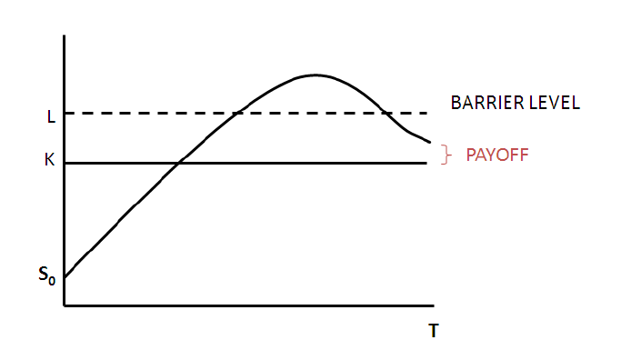

```{r setup, include=FALSE}
knitr::opts_chunk$set(echo = TRUE)
```


## Objective

The objective of this project is to estimate the theoretical price of a European-style up-and-in call option using Monte Carlo simulations. This project also explores the theoretical price of this option and the relationship between the option price and two factors:

1.  Volatility of the underlying asset returns.
2.  Time to maturity of the option.

## Assumptions

1.  The price of the underlying asset follows a Geometric Brownian Motion (GBM) with:
    -   Drift: `r` (risk-free rate minus half the variance).
    -   Volatility: `σ` (annualized standard deviation).
2.  The Monte Carlo method simulates multiple price paths to estimate the payoff of barrier options with continuous barriers.
3.  The barrier level activates the option only if breached before expiry.
4.  Simulations:
    -   Number of iterations: 126
    -   Number of Monte Carlo iterations: 10,000.

## Description of the Option

A European-style up-and-in call option becomes active only if the price of the underlying asset exceeds a specified barrier level (`b`) during the option's life. The payoff of the option at maturity is given by:

$$ \text{Payoff} = \max(S_T - K, 0) $$

if $\max(S_t) \geq b$ for $0 \leq t \leq T$, where:

-   $S_T$: Price of the underlying asset at maturity.
-   $K$: Strike price.
-   $b$: Barrier level.

In the up-and-in call option the following conditions need to be met:

-   The price has to increase to reach the barrier
-   Activated when asset price reaches the barrier


```{r include_image, echo=FALSE}

```


### Characteristics of the Option:

-   **Underlying Price (**$S_0$): 105
-   **Strike Price (**$K$): 110
-   **Volatility (**$\sigma$): 0.21
-   **Risk-Free Rate (**$r$): 0.05
-   **Time to Maturity (**$T$): 0.75 years
-   **Barrier Level (**$b$): 150

## Results of the Simulation

```{r}
library(tidyverse)
library(myoptionPricer2)
loops <- seq(100, 10000, by = 100)
expiry <- seq(0.01, 1, by = 0.01)

```

### Theoretical price of the European up-and-in call option:

```{r}
myoptionPricer2::getEuropeanUpAndInCallPrice(126, 110, 105, 0.21, 0.05, 0.75,150, 10000)
```

### Option price vs. number of loops

```{r}
getMCEuropeanCallPriceWithLoops <- function (loops) {
  return(
    myoptionPricer2::getEuropeanUpAndInCallPrice(126, 110, 105, 0.21, 0.05, 0.75,150,loops)
  )
}

# call the wrapping function
getMCEuropeanCallPriceWithLoops(10000)

# arguments values of values of function
loops  <- seq(100, 10000, by = 100)
prices <- sapply(loops, getMCEuropeanCallPriceWithLoops)

# visualization: options price vs. numbers of loops
tibble(expiry, prices) %>%
  ggplot(aes(expiry, prices)) +
  geom_point(col = "blue") +
  labs(
    x     = "number of loops",
    y     = "option price",
    title = "price of arithmetic European up-and-in call option vs. number of loops",
    caption = "source: own calculations with the myoptionPricer2 package")

```

### Option price vs. time to maturity

```{r}
getMCEuropeanCallPriceWithExpiry <- function (expiry) {
  return(
    myoptionPricer2::getEuropeanUpAndInCallPrice(126, 110, 105, 0.21, 0.05, expiry,150, 10000)
  )
}

# call the wrapping function
getMCEuropeanCallPriceWithExpiry(0.75)

# arguments values of values of function
expiry <- seq(0.01, 1, by = 0.01)
prices <- sapply(expiry, getMCEuropeanCallPriceWithExpiry)

# visualization: options price vs. expiry
tibble( expiry, prices) %>%
  ggplot(aes(expiry, prices)) +
  geom_point(col = "red") +
  labs(
    x     = "time to maturity",
    y     = "option price",
    title = "price of arithmetic European up-and-in call option vs. time  to maturity",
    caption = "source: own calculations with the myoptionPricer2 package")
```

### Option price vs. time to maturity and volatility

```{r}
getMCEuropeanCallPriceWithExpiryAndVol <- function (vol,expiry) {
  return(
    myoptionPricer2::getEuropeanUpAndInCallPrice(126, 110, 105, vol, 0.05,expiry ,150, 10000))
}

# call function once
getMCEuropeanCallPriceWithExpiryAndVol(0.21, 0.75)

# sequences of argument values
expiry <- seq(0.01, 1, by = 0.01)
vol  <- c(0.001, 0.01, 0.02, 0.05, 0.1, 0.15, 0.2, 0.3, 0.5, 1)

grid      <- expand.grid( vol = vol,expiry = expiry)
prices    <- mapply(getMCEuropeanCallPriceWithExpiryAndVol,
                    vol = grid$vol,expiry = grid$expiry)


result.df <- data.frame(grid)
head(result.df)

# visualization: options price vs. time to maturity of the option and volatility
grid %>%
  as_tibble() %>%
  bind_cols(price = prices) %>%
  ggplot(aes(x = expiry, y = price, group = vol, colour = vol)) +
  geom_line() +
  geom_point(size = 1, shape = 21, fill = "white") +
  labs(
    x     = "time to maturity of the option",
    y     = "option price",
    title = "price of arithmetic European up-and-in call option vs. time to maturity of the option and volatility",
    caption = "source: own calculations with the myoptionPricer2 package")


```

## Conclusion:

The Monte Carlo simulation successfully computes the theoretical price of the up-and-in call option. The analysis reveals that:

1.  The option price increases with higher volatility.
2.  The option price also increases with longer times to maturity, reflecting greater chances of breaching the barrier.


## Package information: 

The package is called `myoptionPricer2` based `optionPricer2` package developed in the labs on the basis of code of the `programs/prog2` application. The package is installed and loaded in `myoptionPricer2Application` to test the function created which is `getEuropeanUpAndInCallPrice` and to explore relationship between option price and volatility and time to maturity. I've added `barrier` object to the `EuropeanOption` constructor in `EuropeanOption.h`  and `EuropeanOption.cpp` files and modified `main.cpp` file to return the theoretical price from `getEuropeanUpAndInCallPrice` function and made sure to use `// [[Rcpp::export]]` to be able to use this function. I followed the recording that was provided to us to create the new method/function `getEuropeanUpAndInCallPrice`.


## Reference:

- Material from classes available:<https://github.com/pawelsakowski/AF-RCPP-2024-2025> 

- Barrier description: <https://people.maths.ox.ac.uk/howison/barriers.pdf>

## Declaration:

In accordance with the Honor Code, I certify that my answers here are my own work, and I did not make my solutions available to anyone else.
